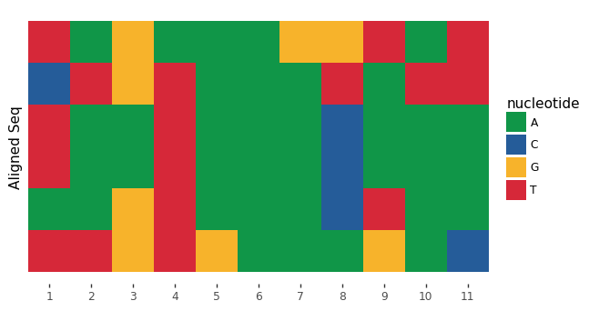

#  Getting Started
## Installation
`pip install plotnineseqsuite`
## Load sample data
```python
from plotnineseqsuite.data import seqs_dna, seqs_aa ,pfms_dna
```
This loads three sample data sets:

- `seqs_dna`: dict of binding sites for 12 transcription factors obtained from FASTA files in [JASPAR](http://jaspar.genereg.net/). The keys represent the JASPAR ID.
- `pfms_dna`: dict of position frequency matrices for four transcription factors obtained from [JASPAR](http://jaspar.genereg.net/). The keys names represent the JASPAR ID.
- `seqs_aa`: dict of kinase-substrate phosphorylation sites obtained from [Wagih et al.](https://www.ncbi.nlm.nih.gov/pubmed/25938373) The keys represent the names of the kinases associated with the phosphosites.
## Visualizing aligned sequences
### Plot an aligned sequences
You can draw an aligned sequences using ggplot function, with geom_alignedSeq. Let’s try this on sequences for one of the transcription factors from JASPAR:
```python
from plotnine import ggplot, coord_fixed
from plotnineseqsuite.align import geom_alignedSeq
from plotnineseqsuite.theme import theme_seq
ggplot() + geom_alignedSeq(seqs_dna['MA0013.1']) + theme_seq() + coord_fixed()
```

### Accepted input formats
geom_alignedSeq accepts two types of input, each described in detail below

1. list: a list of aligned sequences
2. dict: It is used for plotting more than one sequence logo at the same time with the help of facets, the key of dict is facet value, and the value of dict is list described above
### No background color
When bg_col_scheme option is None, the picture has no background color. 
```python
ggplot() + geom_alignedSeq(seqs_dna['MA0013.1'], font_col='black', bg_col_scheme=None) + theme_seq() + coord_fixed()
```

### No sequence letter
When font option is None, the picture has only the background color. 
```python
ggplot() + geom_alignedSeq(seqs_dna['MA0013.1'], font=None) + theme_seq() + coord_fixed()
```

### Tagging sequences
You can set seq_names parameter to identify the name of the sequence.
```python
names=['seq-a', 'seq-b', 'seq-c', 'seq-d', 'seq-e', 'seq-f']
ggplot() + geom_alignedSeq(seqs_dna['MA0013.1'], seq_names=names) + theme_seq() + coord_fixed()
```

## Visualizing sequence logo
### Plot a sequence logo
You can draw a sequence logos using ggplot function, with geom_logo. Let’s try this on sequences for one of the transcription factors from JASPAR:
```python
from plotnine import ggplot
from plotnineseqsuite.logo import geom_logo
from plotnineseqsuite.theme import theme_seq
ggplot() + geom_logo(seqs_dna['MA0001.1']) + theme_seq()
```

### Accepted input formats
geom_logo accepts three types of input, each described in detail below

1. list: a list of aligned sequences
2. numpy.ndarray: a position frequency matrix, where the row is the letter, and column is the position. Note: The order of the rows corresponds to the NAMESPACE one by one.
3. dict: It is used for plotting more than one sequence logo at the same time with the help of facets, the key of dict is facet value, and the value of dict is list or numpy.ndarray described above

The following generates a sequence logo using a position frequency matrix from the sample data
```python
ggplot() + geom_logo(pfms_dna['MA0018.2'],seq_type='DNA') + theme_seq()
```

### Plotting methods
geom_logo supports two sequence logo methods through the method options: ‘bits’ and ‘probability’. By default, the bits is used.
```python
ggplot() + geom_logo( seqs_dna['MA0001.1'], method = 'bits' ) + theme_seq()
ggplot() + geom_logo( seqs_dna['MA0001.1'], method = 'probability' ) + theme_seq()
```


### Custom-height logos
If you have your own height metric for each letter, simply create a matrix where each cell is a the desired height, and set the method to custom. You can even have negative heights. Here’s a simple example:
```python
import numpy as np
custom_mat = np.random.randn(4,5)
ggplot() + geom_logo(custom_mat, method='custom', seq_type='DNA') + theme_seq()
```

## Visualizing sequence histogram
### Plot a sequence histogram
You can draw a conservation bar of aligned sequences using ggplot function, with geom_seqBar. Let’s try this on sequences for one of the transcription factors from JASPAR:
```python
from plotnineseqsuite.bar import geom_seqBar
ggplot() + geom_seqBar(seqs_dna['MA0013.1']) + theme_seq()
```

### Accepted input formats
geom_seqBar accepts three types of input, each described in detail below

1. list: a list of aligned sequences
2. numpy.ndarray: a position frequency matrix, where the row is the letter, and column is the position. Note: The order of the rows corresponds to the NAMESPACE one by one.
3. dict: It is used for plotting more than one sequence histogram at the same time with the help of facets, the key of dict is facet value, and the value of dict is list or numpy.ndarray described above

The following generates a sequence histogram using a position frequency matrix from the sample data
```python
ggplot() + geom_seqBar(pfms_dna['MA0018.2'],seq_type='DNA') + theme_seq()
```

### No sequence letter
When font option is None, the picture has only the bar.
```python
ggplot() + geom_seqBar(seqs_dna['MA0013.1'], font=None) + theme_seq()
```

## Sequence types
### Preset alphabets
Amino acids, DNA and RNA sequence types are all supported by geom_logo, geom_seqBar and geom_alignedSeq. By default, plotnineSeqSuite will try to guess your sequence type. You can explicitly set the sequence type through the seq_type option.

Lets try generate an amino acid sequence logo using kinase-substrate phosphorylation data:
```python
ggplot() + geom_logo( seqs_aa['AKT1'], seq_type = 'AA' ) + theme_seq()
```

### Custom alphabet
If you want to define a custom alphabet you can do so by setting namespace with your desired custom alphabet. For example, lets say you wanted a sequence logo of zeros and ones:
```python
from plotnine.guides import guides
seqs_numeric = list(map(lambda x: x.replace('A','1').replace('T','2').replace('G','3').replace('C','4'), seqs_dna['MA0001.1']))
ggplot() + geom_logo(seqs_numeric, method='probability', namespace=['1','2','3','4']) + theme_seq()+guides(fill=False)
```
   
Greek letters are also supported:
```python
seqs_numeric = list(map(lambda x: x.replace('A','δ').replace('T','ε').replace('G','ψ').replace('C','λ'), seqs_dna['MA0001.1']))
ggplot() + geom_logo(seqs_numeric, method='probability', namespace=['δ','ε','ψ','λ']) + theme_seq()+guides(fill=False)
```

## Colour schemes
### Preset color schemes
plotnineSeqSuite has preset color schemes that can be set using the col_scheme parameter in geom_logo, the parameter bar_col_scheme in geom_seqBar and the parameter bg_col_scheme in geom_alignedSeq. By default, the col_scheme is set to AUTO such that the color scheme is automatically chosen based on your sequence type.

Lets try generate an amino acid sequence logo using kinase-substrate phosphorylation data:
```python
ggplot() + geom_logo(seqs_dna['MA0001.1'], col_scheme='base_pairing') + theme_seq()
```

### Custom color schemes
If the presets are not enough for you, you can define custom discrete or continuous color schemes using the col_schemes.make_col_scheme function. Here are two examples of discrete and continuous color schemes.
#### Discrete color schemes
```python
from plotnineseqsuite.col_schemes import make_col_scheme
cs1 = make_col_scheme(chars=['A', 'T', 'C', 'G'], groups=['gr1', 'gr1', 'gr2', 'gr2'],cols=['purple', 'purple', 'blue', 'blue'])
ggplot() + geom_logo(seqs_dna['MA0001.1'], col_scheme=cs1) + theme_seq()
```

#### Continuous color schemes
```python
cs2 = make_col_scheme(chars=['A', 'T', 'C', 'G'], values=[1,2,3,4])
ggplot() + geom_logo(seqs_dna['MA0001.1'], col_scheme=cs2) + theme_seq()
```

## Multiple grouped sequences
You can plot more than one grouped sequences at the same time with the help of facets. plotnineSeqSuite will accept a dict. The keys of the dict will be used as the facet titles. Take geom_logo for example.
```python
from plotnine import facet_wrap
ggplot() + geom_logo(seqs_dna)+ theme_seq()+facet_wrap('~seq_group', ncol=4, scales='free_x')
```

## Fonts
You can adjust the font of letters by setting the font parameter. To list all the available color schemes use the font.list_fonts function. Take geom_logo for example.
```python
from plotnine import ggtitle
import patchworklib as pw
from plotnineseqsuite.font import list_fonts

fonts = list_fonts()
for i in range(0,12,3):
    g1 = pw.load_ggplot(ggplot() + geom_logo(data=seqs_dna['MA0001.1'], font=fonts[i]) + theme_seq()+ggtitle(fonts[i]))
    g2 = pw.load_ggplot(ggplot() + geom_logo(data=seqs_dna['MA0001.1'], font=fonts[i+1]) + theme_seq() + ggtitle(fonts[i+1]))
    g3 = pw.load_ggplot(ggplot() + geom_logo(data=seqs_dna['MA0001.1'], font=fonts[i+2]) + theme_seq() + ggtitle(fonts[i+2]))
    if i == 0:
        allgg = g1|g2|g3
    else:
        temp = g1|g2|g3
        allgg = temp/allgg
allgg.savefig()
```

## Advanced plotnineSeqSuite
plotnineSeqSuite is based on object-oriented design. The *_data property of class geom_logo and geom_seqBar, geom_alignedSeq is a core feature.
### Combining plots
Without using any packages like patchwork and cowplot, plotnineSeqSuite can easily plot geom_logo and geom_seqBar, geom_alignedSeq in one figure. I’ll demonstrate with an example plotting probability sequence logo, aligned sequences and sequence histogram in one figure via changed *_data property.
```python
from plotnine import scale_y_continuous
names = ['seq-a', 'seq-b', 'seq-c', 'seq-d', 'seq-e', 'seq-f']
seqs = geom_alignedSeq(seqs_dna['MA0013.1'], seq_names=names)
logo = geom_logo(seqs_dna['MA0013.1'], method='probability')
logo.data['y'] = logo.data['y']+6.1
bar = geom_seqBar(seqs_dna['MA0013.1'], font=None)
bar.bar_data['y'] = bar.bar_data['y'] - 6.1
ggplot() + logo + bar + seqs + theme_seq() + scale_y_continuous(breaks=lambda x: [k + 0.5 for k in range(0, len(names))], labels=names)
```

### Modify the starting position
When the input sequence fragment does not start at 1, you can modify the x value of the property to display the correct starting position.
```python
names = ['seq-a', 'seq-b', 'seq-c', 'seq-d', 'seq-e', 'seq-f']
seqs = geom_alignedSeq(seqs_dna['MA0013.1'], seq_names=names)
seqs.bg_data['x'] = seqs.bg_data['x']+3333
seqs.letter_data['x'] = seqs.letter_data['x']+3333
ggplot() + seqs + theme_seq()
```

### Used concurrently with other functions of plotnine.
Because plotnineSeqSuite is an extension of plotnine, functions of plotnine can be used without obstacles. Here is an example of drawing rectangles, lines and text.
```python
from plotnine.geoms import annotate
ggplot() + geom_alignedSeq(seqs_dna['MA0013.1']) + annotate('rect', xmin=0.5, xmax=3.5, ymin=-0.05, ymax=6.1,alpha=.1, color='black') + theme_seq()
```

```python
ggplot() + geom_seqBar(seqs_dna['MA0013.1']) + annotate('segment', x=1.5, xend=2.5, y=0, yend=0, size=2, color='red') + annotate('segment', x=4.5, xend=7.5, y=0, yend=0, size=2, color='red') + annotate('segment', x=8.5, xend=11.5, y=0, yend=0,size=2, color='red') + annotate('text', x=6, y=-0.2,label='A is the most', color='red') + theme_seq()
```
